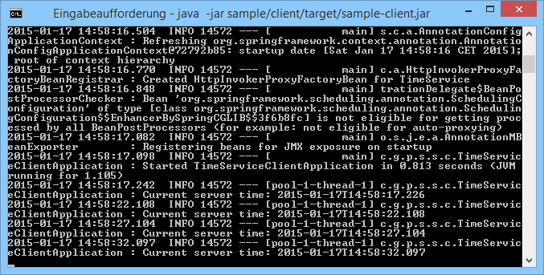

About
=====

This repository contains a proof of concept for easily establishing 
client-server communication using Spring Remoting in Java.

Spring’s HTTP invoker is a good choice if you need HTTP-based remoting but also 
rely on Java serialization. It can be cumbersome to configure though because every 
new service that you wish to share among server and client needs to be registered 
in both application contexts manually via XML configuration.

This proof of concept showcases a more convenient approach, leveraging 
annotation based configuration and class path scanning.

Basic Concept
=============

1. Mark the interfaces of services that you wish to export as remote service using the `@RemoteExport` annotation
2. On the server-side, use the `@EnableHttpInvokerAutoExport` annotation in your Spring configuration class
  * A Spring bean implementing the interface **must** be available in the application context
  * By default the service will be exported with the mapping path `/<InterfaceName>`
  * The default mapping path can be overridden using the `mappingPath` property
   of the `@EnableHttpInvokerAutoExport` annotation
3. On the client-side, use the `@EnableHttpInvokerAutoProxy` annotation in your Spring configuration class
  * Proxies will be automatically created for every annotated interface that is 
   found in the classpath using the package of the annotated configuration class as base package by default
  * The base package can also be explicitly specified using the `basePackages` property
   of the `@EnableHttpInvokerAutoProxy` annotation
  * For remote invocation the service URL is build from a base URL and the individual mapping path of the service
  * The base URL defaults to *http://localhost:8080* and can be overridden using the system property *remote.baseUrl*

Sample Application
==================

A sample application providing a simple time service is supplied in this repository.

To run it, simply perform a Maven build, then open a terminal and execute the following command:

```
java -jar sample/server/target/sample-server.jar
```

Now open another terminal and execute this command:
```
java -jar sample/client/target/sample-client.jar
```

If everything worked out as expected, you should see the client printing out the 
current server time every 5 seconds as pictured in the screenshot below.


